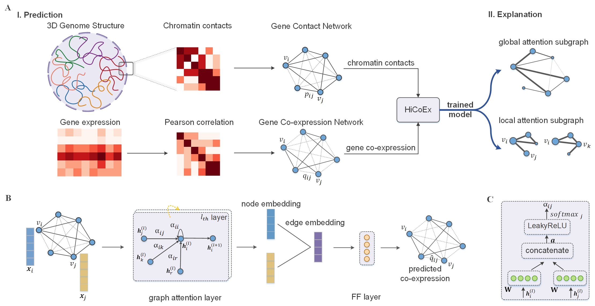

# HiCoEx

 

The paper is published on *Bioinformatics* named [Prediction of Gene Co-expression from Chromatin Contacts with Graph Attention Network](https://doi.org/10.1093/bioinformatics/btac535).

## Citation
If you want to use our codes and datasets in your research, please cite:
```
@article{10.1093/bioinformatics/btac535,
    author = {Zhang, Ke and Wang, Chenxi and Sun, Liping and Zheng, Jie},
    title = "{Prediction of gene co-expression from chromatin contacts with graph attention network}",
    journal = {Bioinformatics},
    year = {2022},
    month = {08},
    issn = {1367-4803},
    doi = {10.1093/bioinformatics/btac535},
    url = {https://doi.org/10.1093/bioinformatics/btac535}
    }
```

## Data preprocessing
The files in this folder preprocess all RNA-seq and Hi-C data. The sources of datasets include two parts. The first is pancreatic islet data, collected from [*Greenwald et al. 2019*](https://www.nature.com/articles/s41467-019-09975-4) for Hi-C and [*Fadista et al. 2014*](https://doi.org/10.1073/pnas.1402665111) for RNA-seq data. The second is dataset with 12 types of tissues and cell lines, following [*Marco et al. 2020*](https://doi.org/10.1093/bioinformatics/btaa803). 

Change the dataset_path in each script for storing input and output data. There are two data files already provided: GTEx_Analysis_v8_Annotations_SampleAttributesDS file (RNA-seq data download from GTEx) and GRCh37_p13_gene_info file (genome annotation). Other data could be downloaded according to the accession numbers in the paper. For RNA-seq data downloaded from GTEx, run `run_split_tissues.sh` first to split the samples according to the tissu types.

01_gene_expression_islet.py and 02_hic_islet.py are for pancreatic islet data specially, and others are adapted from [*Marco et al. 2020*](https://doi.org/10.1093/bioinformatics/btaa803).  

## Network construction
The files in this folder construst gene co-expression network and gene contact network. Specifying --chr-src and --chr-tgt with same value (from 1 to 22) could construct the network for a certain chromosome. In 02_coexpression_network.py and 04_chromatin_network.py, specifying --single-chrom with False could construct a genome-wide network of all intra-chromosomal coexpression/contact relations.

## Link prediction
The files in this folder implement link prediction with HiCoEx and all baselines. train_GNN.py and gnn_model.py are for training all GNN models. Specifying --classifier with 'mlp' takes the FF layer as the classifier, and specifying --classifier with 'direct' takes the dot product of edge embedding as the classifier.   

For all baselines, first run matrix_factorization.py and random_walk.py to generate the gene embeddings from gene contact network (required [BioNEV library](https://github.com/xiangyue9607/BioNEV)).   

01_link_prediction_chromosome.py implements co-expression prediction for each intra chromosome, 02_link_prediction_chrosome.py implements co-expression prediction for the dataset of genome-wide intra chromosomes.

## Model explanation
The files in this folder are to explain the gene embeddings learned from HiCoEx and analyze the specific subgraph of gene pairs. After training the model, one can reproduce the results of Figure 5 in the paper by biological_explanation_reproduce.ipynb.   

For example, to conduct experiments on aorta (a type of tissue), you need to download the raw Hi-C data first according to the accession number `GSE87112` (provided in the Table 1 and section of Data availability in our paper), and run `run_split_tissues.sh` first to split the samples according to the tissue types, then run `run_aorta.sh` to finish all the above steps.

## Acknowledgement
Code of data preprocessing and link prediction by baseline methods (random-rf, topological-rf, svd-rf,  node2vec-rf) are adapted from [*Marco et al. 2020*](https://doi.org/10.1093/bioinformatics/btaa803) with the repository https://github.com/marcovarrone/gene-expression-chromatin.
